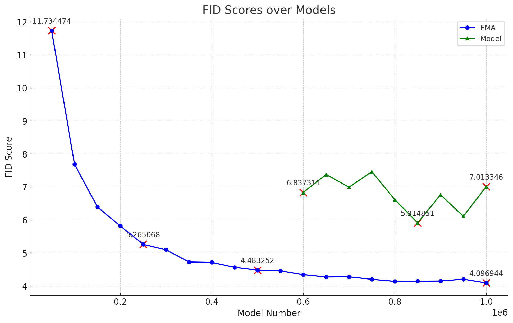
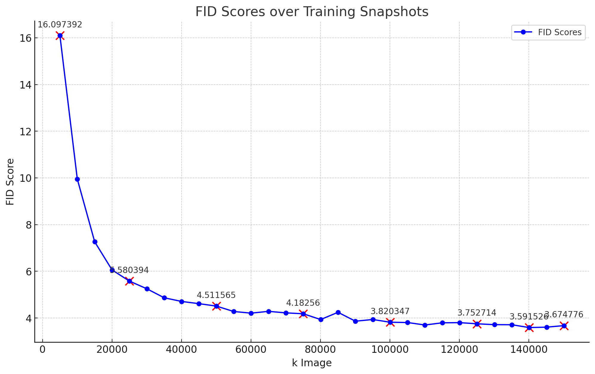

# Mini-EDM -- A minimalistic EDM with all the essence

## Introduction
To train or evaluate the EDM, please follow the command in *run.sh*.

## Results
Results FID on CIFAIR-10:

  
  <em>FID of this implementation.</em>

Reference FID from the original EDM codebase using the same model architecture and the same batch size of 128 (nothing else changed):

  
  <em>FID of original EDM.</em>

The difference may come from the learning rate and warmup strategy.
